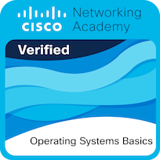

# Hi! I'am Hakan Ören 👾

## About Me 

I am currently training to become a cybersecurity specialist, aiming to develop innovative solutions in this field. I have expertise in computer-aided design, electronic circuit design, Arduino programming, video editing, and 3D printing. In the past, I developed Turkey's first model rocket with thrust vector control capability to start a new trend in model rocketry in Turkey.

I possess strong technical and communication skills, capable of analyzing and solving complex problems with ease. My goal is to establish a place in the cybersecurity world and make groundbreaking advancements by integrating artificial intelligence.

My language skills are as follows: English (B1), French (A2), Turkish (native).

## Social Media
* Twitter: https://x.com/pagan1ni
* Youtube: https://www.youtube.com/@AcidaliaLabs
* Linkedin: https://www.linkedin.com/in/hakan-%C3%B6ren-19aa79191/
* TryHackMe: https://tryhackme.com/p/pagan1ni
* Medium: https://medium.com/@hakanoren

## Badges

 
 
